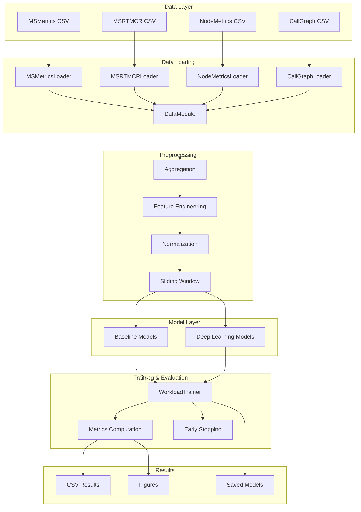
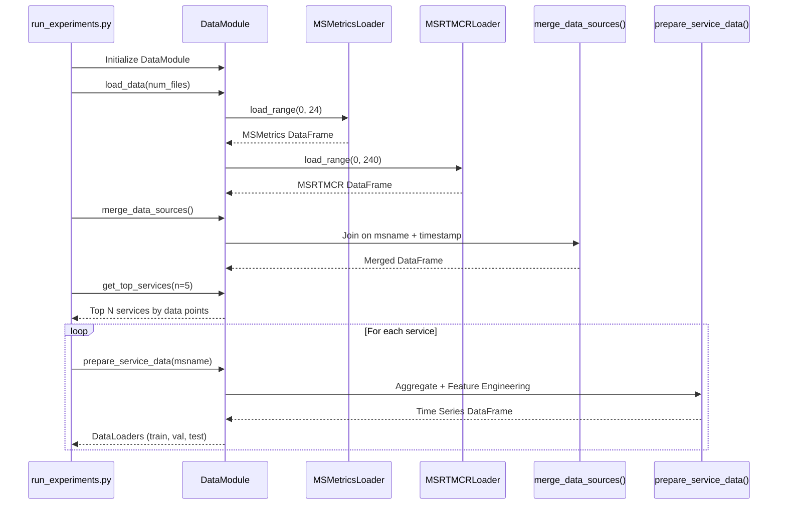
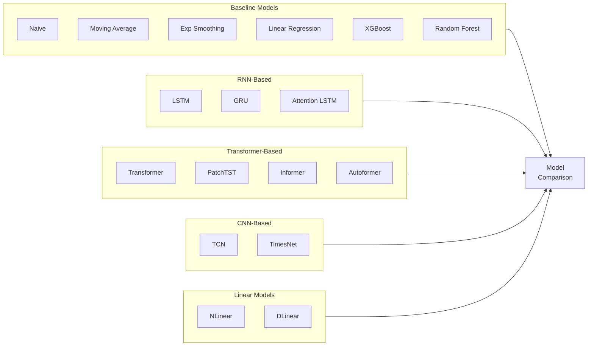
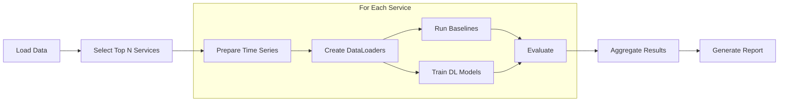

# Microservices Workload Prediction Experiment

> A comprehensive experiment for predicting CPU utilization in microservices systems using the Alibaba Cluster Trace v2022 dataset.

---

## Table of Contents

- [1. Overview](#1-overview)
- [2. Dataset Description](#2-dataset-description)
- [3. Project Architecture](#3-project-architecture)
- [4. Data Pipeline](#4-data-pipeline)
- [5. Models](#5-models)
- [6. Experiment Methodology](#6-experiment-methodology)
- [7. Results](#7-results)
- [8. Quick Start](#8-quick-start)
- [9. Code Structure Reference](#9-code-structure-reference)

---

## 1. Overview

### 1.1 Problem Statement

In modern cloud computing environments, microservice architectures have become the de facto standard for building scalable applications. However, efficient resource management requires accurate **workload prediction** to:

- **Prevent resource waste** by avoiding over-provisioning
- **Ensure Quality of Service (QoS)** by preventing under-provisioning
- **Enable proactive auto-scaling** rather than reactive scaling

This experiment focuses on predicting **CPU utilization** of microservices using historical time series data.

### 1.2 Research Goals

1. Evaluate multiple prediction models (statistical baselines + deep learning)
2. Identify the best-performing model for short-term workload forecasting
3. Understand the characteristics of microservice workload patterns

### 1.3 Key Findings (Summary)

| Rank | Model | RMSE | R² |
|------|-------|------|-----|
| 1 | **NLinear** | 0.0491 | 0.57 |
| 2 | Linear Regression | 0.0510 | 0.54 |
| 3 | Naive (Last Value) | 0.0520 | 0.52 |
| 4 | Exponential Smoothing | 0.0528 | 0.50 |
| 5 | GRU | 0.0553 | 0.45 |

> [!TIP]
> Simple linear models (NLinear) outperform complex Transformer-based models for short-term (1-step) workload prediction on this dataset.

---

## 2. Dataset Description

### 2.1 Alibaba Cluster Trace v2022

The dataset is from the **Alibaba Cluster Trace Program**, containing runtime metrics of ~20,000 microservices collected from production clusters over 13 days.

```bibtex
@inproceedings{luo2022Prediction,
  title={The Power of Prediction: Microservice Auto Scaling via Workload Learning},
  author={Luo, Shutian and Xu, Huanle and others},
  booktitle={ACM Symposium on Cloud Computing},
  year={2022}
}
```

### 2.2 Data Sources

The experiment uses data downloaded with `start_date=0d0` and `end_date=0d12` (12 hours of data):

| Data Source | Files | Description |
|-------------|-------|-------------|
| **MSMetrics** | 24 files (30 min each) | CPU, memory utilization per microservice instance |
| **MSRTMCR** | 240 files (3 min each) | Call rates (MCR) and response times (RT) |
| **NodeMetrics** | 1 file | Bare-metal node CPU/memory utilization |
| **CallGraph** | 240 files | Service call dependencies |

### 2.3 Data Schema

#### MSMetrics (Primary Data Source)

| Column | Description | Example |
|--------|-------------|---------|
| `timestamp` | Recording time (ms), 60s interval | 180000 |
| `msname` | Microservice name | MS_21881 |
| `msinstanceid` | Container instance ID | MS_21881_POD_0 |
| `nodeid` | Bare-metal node ID | NODE_11517 |
| `cpu_utilization` | Normalized CPU usage (0-1) | 0.2199 |
| `memory_utilization` | Normalized memory usage (0-1) | 0.8330 |

#### MSRTMCR (Supplementary Features)

Contains MCR (Microservice Call Rate) and RT (Response Time) for different communication paradigms:

- **RPC**: `providerrpc_mcr`, `consumerrpc_mcr`, `providerrpc_rt`, `consumerrpc_rt`
- **HTTP**: `http_mcr`, `http_rt`
- **Database**: `readdb_mcr`, `writedb_mcr`, `readdb_rt`, `writedb_rt`
- **Memcached**: `readmc_mcr`, `writemc_mcr`, `readmc_rt`, `writemc_rt`
- **Message Queue**: `providermq_mcr`, `consumermq_mcr`, `providermq_rt`, `consumermq_rt`

> [!NOTE]
> All utilization values and MCR values are **normalized** using the max-min method.

---

## 3. Project Architecture

### 3.1 System Overview



### 3.2 File Structure

```
workload_prediction/
├── config.py              # Configuration (data paths, model params, experiment settings)
├── data_loader.py         # Data loading and preprocessing
├── data_analysis.py       # Analysis and visualization utilities
├── models.py              # Deep learning model implementations
├── baseline_models.py     # Statistical and ML baseline models
├── trainer.py             # Training loop and evaluation
├── run_experiments.py     # Main experiment entry point
├── experiment.ipynb       # Interactive Jupyter notebook
├── result.ipynb           # Results visualization notebook
├── requirements.txt       # Python dependencies
└── outputs/
    ├── models/            # Saved model checkpoints
    ├── figures/           # Generated plots
    └── results/           # CSV/JSON result files
```

---

## 4. Data Pipeline

### 4.1 Data Loading Flow



### 4.2 Feature Engineering

The `FeatureEngineer` class adds derived features:

| Feature Type | Examples | Purpose |
|--------------|----------|---------|
| **Lag Features** | `cpu_lag_1`, `cpu_lag_6`, `cpu_lag_12` | Capture temporal dependencies |
| **Rolling Statistics** | `cpu_rolling_mean_3`, `cpu_rolling_std_6` | Smooth noise, capture trends |
| **Difference Features** | `cpu_diff_1`, `cpu_diff_2` | Capture rate of change |
| **Time Features** | `hour_sin`, `hour_cos`, `minute_sin` | Capture cyclical patterns |

### 4.3 Data Splitting Strategy

```
Time-based split (chronological order preserved):
├── Training (70%)    → First 70% of timestamps
├── Validation (15%)  → Next 15% of timestamps  
└── Test (15%)        → Final 15% of timestamps
```

> [!IMPORTANT]
> Normalization is applied **after** splitting to prevent data leakage. The scaler is fit only on training data.

---

## 5. Models

### 5.1 Model Categories



### 5.2 Baseline Models

| Model | Description | Implementation |
|-------|-------------|----------------|
| **Naive** | Predict last observed value | `NaivePredictor` |
| **Moving Average** | Average of last N values (window=3,6,12) | `MovingAveragePredictor` |
| **Exponential Smoothing** | Weighted average with decay (α=0.2,0.5) | `ExponentialSmoothingPredictor` |
| **Seasonal Naive** | Value from one period ago | `SeasonalNaivePredictor` |
| **Linear Regression** | Flatten sequence → linear mapping | `LinearRegressionPredictor` |
| **XGBoost** | Gradient boosting on flattened features | `XGBoostPredictor` |
| **LightGBM** | Light gradient boosting | `LightGBMPredictor` |
| **Random Forest** | Ensemble of decision trees | `RandomForestPredictor` |

### 5.3 Deep Learning Models

#### RNN-Based Models

| Model | Key Features | Reference |
|-------|--------------|-----------|
| **LSTM** | Long-term dependencies, forget gate | Hochreiter & Schmidhuber, 1997 |
| **GRU** | Simpler than LSTM, fewer parameters | Cho et al., 2014 |
| **Attention LSTM** | LSTM + scaled dot-product attention | Bahdanau et al., 2015 |

#### Transformer-Based Models

| Model | Key Features | Reference |
|-------|--------------|-----------|
| **Transformer** | Multi-head self-attention | Vaswani et al., 2017 |
| **PatchTST** | Patches time series, applies transformer | ICLR 2023 |
| **Informer** | ProbSparse attention for efficiency | AAAI 2021 |
| **Autoformer** | Auto-correlation + decomposition | NeurIPS 2021 |

#### CNN-Based Models

| Model | Key Features | Reference |
|-------|--------------|-----------|
| **TCN** | Dilated causal convolutions | Bai et al., 2018 |
| **TimesNet** | Converts to 2D, inception convolutions | ICLR 2023 |

#### Linear Models (State-of-the-Art for Short-Term)

| Model | Key Features | Reference |
|-------|--------------|-----------|
| **NLinear** | Normalize by last value → Linear | AAAI 2023 |
| **DLinear** | Decompose (trend/seasonal) → Linear | AAAI 2023 |

> [!NOTE]
> NLinear and DLinear were proposed in "Are Transformers Effective for Time Series Forecasting?" (AAAI 2023) and demonstrate that simple linear models can outperform complex transformers for many forecasting tasks.

### 5.4 Model Configuration

Key hyperparameters (from `config.py`):

```python
# Sequence configuration
seq_length = 12       # Input: 12 time steps (12 minutes)
pred_length = 1       # Output: 1 time step (1 minute ahead)

# Training configuration
batch_size = 32
learning_rate = 0.0005
num_epochs = 200
early_stopping_patience = 20

# Data split
train_ratio = 0.70
val_ratio = 0.15
test_ratio = 0.15
```

---

## 6. Experiment Methodology

### 6.1 Experiment Workflow



### 6.2 Evaluation Metrics

| Metric | Formula | Description |
|--------|---------|-------------|
| **MSE** | $\frac{1}{n}\sum(y - \hat{y})^2$ | Mean Squared Error |
| **RMSE** | $\sqrt{MSE}$ | Root Mean Squared Error |
| **MAE** | $\frac{1}{n}\sum\|y - \hat{y}\|$ | Mean Absolute Error |
| **MAPE** | $\frac{100}{n}\sum\|\frac{y - \hat{y}}{y}\|$ | Mean Absolute Percentage Error |
| **sMAPE** | $\frac{200}{n}\sum\frac{\|y - \hat{y}\|}{\|y\| + \|\hat{y}\|}$ | Symmetric MAPE |
| **R²** | $1 - \frac{SS_{res}}{SS_{tot}}$ | Coefficient of Determination |

### 6.3 Training Process

1. **Initialize** model with configuration parameters
2. **Forward pass** through model
3. **Compute loss** (MSE or Huber loss)
4. **Backpropagation** with gradient clipping (max=1.0)
5. **Learning rate scheduling** (ReduceLROnPlateau, factor=0.5)
6. **Early stopping** if validation loss doesn't improve for 20 epochs
7. **Save best model** based on validation loss

---

## 7. Results

### 7.1 Performance Comparison

The experiment evaluated **20 models** across multiple microservices. Results show the average performance:

| Model | RMSE ↓ | MAE ↓ | MAPE (%) ↓ | R² ↑ | Train Time (s) |
|-------|--------|-------|------------|------|----------------|
| **NLinear** | **0.0491** | **0.0363** | **3.27** | **0.57** | 1.23 |
| Linear Regression | 0.0510 | 0.0373 | 3.32 | 0.54 | 0.00 |
| Naive (Last Value) | 0.0520 | 0.0377 | 3.39 | 0.52 | 0.00 |
| Exp Smoothing (α=0.5) | 0.0528 | 0.0402 | 3.60 | 0.50 | 0.00 |
| GRU | 0.0553 | 0.0431 | 3.84 | 0.45 | 9.81 |
| DLinear | 0.0570 | 0.0425 | 3.80 | 0.42 | 3.41 |
| Moving Average (3) | 0.0571 | 0.0438 | 3.92 | 0.42 | 0.00 |
| ATTENTION_LSTM | 0.0649 | 0.0520 | 4.65 | 0.25 | 10.18 |
| LSTM | 0.0694 | 0.0562 | 5.08 | 0.14 | 6.43 |
| PatchTST | 0.0770 | 0.0642 | 5.73 | -0.06 | 5.80 |
| TRANSFORMER | 0.1821 | 0.1682 | 14.89 | -4.94 | 8.05 |
| INFORMER | 0.2074 | 0.1967 | 17.53 | -6.70 | 7.21 |
| AUTOFORMER | 0.7121 | 0.7034 | 63.82 | -89.80 | 22.18 |

### 7.2 Key Observations

> [!IMPORTANT]
> **Finding 1: Simple models win for short-term prediction**
> 
> NLinear (13 parameters) outperforms Transformers (100K+ parameters) for 1-step ahead prediction. This aligns with recent research showing that for short horizons, simple linear mappings capture the essential patterns.

> [!IMPORTANT]
> **Finding 2: The Naive baseline is surprisingly strong**
> 
> The naive predictor (just repeating the last value) achieves R²=0.52, indicating high autocorrelation in workload data. This sets a strong minimum bar for any model.

> [!WARNING]
> **Finding 3: Complex Transformer models struggle**
> 
> Transformer, Informer, and Autoformer show negative R² values, indicating they perform worse than simply predicting the mean. This suggests overfitting or that the attention mechanism doesn't capture relevant patterns for this task.

### 7.3 Model Complexity vs Performance

| Model Category | Avg RMSE | Avg Parameters | Training Time |
|----------------|----------|----------------|---------------|
| Statistical Baselines | 0.056 | 0 | <1 sec |
| Linear (NLinear/DLinear) | 0.053 | ~20 | 1-3 sec |
| RNN-Based | 0.062 | ~50K | 6-10 sec |
| Transformer-Based | 0.300 | ~120K | 7-22 sec |
| CNN-Based | 0.090 | ~120K | 3-13 sec |

---

## 8. Quick Start

### 8.1 Installation

```bash
# Navigate to the project directory
cd cluster-trace-microservices-v2022/workload_prediction

# Install dependencies
pip install -r requirements.txt
```

### 8.2 Running Experiments

#### Option 1: Command Line

```bash
# Quick test (2 services, 10 epochs)
python run_experiments.py --quick

# Full experiment (5 services, 50 epochs)
python run_experiments.py --num_services 5 --num_epochs 50

# Custom configuration
python run_experiments.py --num_services 10 --num_epochs 100 --num_msmetrics 24
```

#### Option 2: Jupyter Notebook

Open `experiment.ipynb` for interactive experimentation, or `result.ipynb` to visualize existing results.

### 8.3 Configuration

Edit `config.py` to modify:

```python
# Data paths
DATA_CONFIG.data_root = "/path/to/your/data"

# Model parameters
MODEL_CONFIG.seq_length = 12      # Input sequence length
MODEL_CONFIG.pred_length = 1      # Prediction horizon
MODEL_CONFIG.num_epochs = 200     # Training epochs

# Experiment settings
EXPERIMENT_CONFIG.target_variable = "cpu_utilization"
```

### 8.4 Expected Output

```
outputs/
├── models/
│   └── best_model.pt          # Best performing model checkpoint
├── figures/
│   ├── model_comparison_rmse.png
│   ├── performance_heatmap.png
│   └── training_time.png
└── results/
    ├── all_models_comparison.csv
    ├── results_table.tex
    └── full_results.json
```

---

## 9. Code Structure Reference

### 9.1 Key Classes

| File | Class | Purpose |
|------|-------|---------|
| `data_loader.py` | `MSMetricsLoader` | Load MSMetrics CSV files |
| `data_loader.py` | `MSRTMCRLoader` | Load MSRTMCR CSV files |
| `data_loader.py` | `DataModule` | High-level data management |
| `data_loader.py` | `WorkloadTimeSeriesDataset` | PyTorch Dataset for sliding windows |
| `data_loader.py` | `FeatureEngineer` | Add lag, rolling, time features |
| `models.py` | `LSTMPredictor` | LSTM-based model |
| `models.py` | `TransformerPredictor` | Transformer encoder model |
| `models.py` | `NLinear` / `DLinear` | Linear models (SOTA) |
| `baseline_models.py` | `BasePredictor` | Abstract base for baselines |
| `trainer.py` | `WorkloadTrainer` | Training loop with early stopping |
| `trainer.py` | `compute_metrics` | Calculate evaluation metrics |

### 9.2 Key Functions

```python
# Data loading
dm = DataModule()
dm.load_data(num_msmetrics_files=24, num_msrtmcr_files=100)
dm.merge_data_sources()

# Get top services by data volume
top_services = dm.get_top_services(n=5, min_points=100)

# Prepare time series for a service
ts_data = dm.prepare_service_data("MS_12345", add_features=True)

# Create dataloaders (auto-splits train/val/test)
train_loader, val_loader, test_loader = dm.create_dataloaders(
    ts_data.values, 
    target_idx=0,
    normalize=True
)

# Train model
from models import create_model
model = create_model("nlinear", input_size=ts_data.shape[1])
trainer = WorkloadTrainer(model)
trainer.train(train_loader, val_loader, num_epochs=50)

# Evaluate
metrics = trainer.evaluate(test_loader)
```

### 9.3 Adding a New Model

1. **Define model class** in `models.py`:

```python
class MyNewModel(nn.Module):
    def __init__(self, input_size, seq_length, pred_length=1, **kwargs):
        super().__init__()
        # Define layers
    
    def forward(self, x):
        # x: (batch, seq_length, input_size)
        # return: (batch, pred_length)
        pass
```

2. **Register in `create_model` function**:

```python
def create_model(model_type, input_size, **kwargs):
    if model_type == 'mynewmodel':
        return MyNewModel(input_size, **kwargs)
    # ... other models
```

3. **Add to experiment config**:

```python
# In config.py
EXPERIMENT_CONFIG.deep_learning_models.append("mynewmodel")
```

---

## References

1. Luo, S., Xu, H., et al. "The Power of Prediction: Microservice Auto Scaling via Workload Learning." SoCC 2022.
2. Zeng, A., et al. "Are Transformers Effective for Time Series Forecasting?" AAAI 2023.
3. Zhou, H., et al. "Informer: Beyond Efficient Transformer for Long Sequence Time-Series Forecasting." AAAI 2021.
4. Wu, H., et al. "Autoformer: Decomposition Transformers with Auto-Correlation for Long-Term Series Forecasting." NeurIPS 2021.
5. Nie, Y., et al. "A Time Series is Worth 64 Words: Long-term Forecasting with Transformers." ICLR 2023.
6. Wu, H., et al. "TimesNet: Temporal 2D-Variation Modeling for General Time Series Analysis." ICLR 2023.

---

> **Last Updated**: December 2024  
> **Author**: Workload Prediction Research Team
